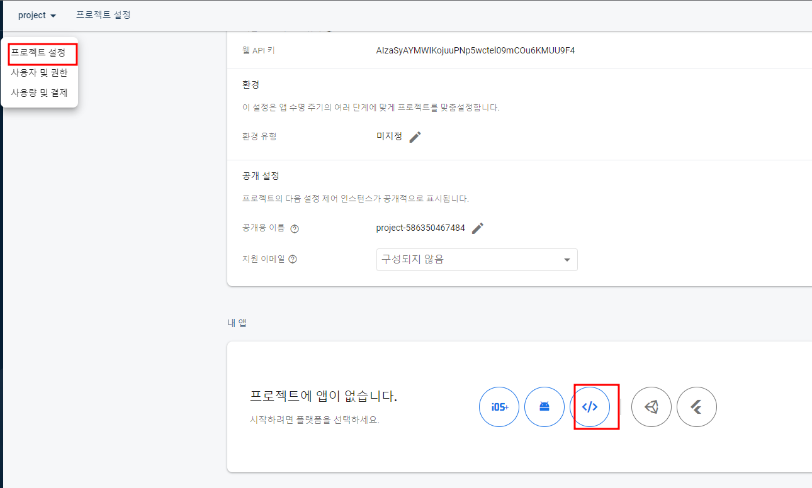
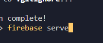

# 프로그래밍

# react

#### JSX

.JS파일에서 쓰는 HTML 대용품
1.class 대신 classname
2.{} 중괄호써서 데이터바인딩
3.style = {{fontSize:'15px'}} 이런식으로 중괄호 두번쓰기, font-size라고 쓰지않고 fontSize 같이 '-' 부호 스타일에서 쓰지않음
-3강끝

# firebase

<!-- react나 vue 사용시 터미널 npm install firebase 입력하면 끝 -->

vsc랑 node js 다운로드


터미널에

##### npm install -g firebase-tools@9.23.1 입력

터미널에

#### firebase login

firebase.ps1 파일을 로드할 수 없습니다.오류
PowerShell을 관리자 권한으로 실행시키고,
Set-ExecutionPolicy RemoteSigned
명령어를 실행

#### firebase init

storeage hosting firestore DB

setting 완료 후

```
    <script defer src="/__/firebase/10.3.1/firebase-app-compat.js"></script>
    <script defer src="/__/firebase/10.3.1/firebase-auth-compat.js"></script>
    <script defer src="/__/firebase/10.3.1/firebase-firestore-compat.js"></script>
    <script defer src="/__/firebase/10.3.1/firebase-storage-compat.js"></script>

```

스크립트 파일만 남겨두고 다 지우기


#### 호스팅에서 나온 코드로 스크립트 하나 더 만들어서 총 5개



#### 터미널 firebase serve 명령어로 미리보기가능
